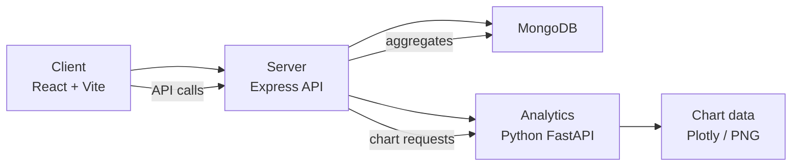
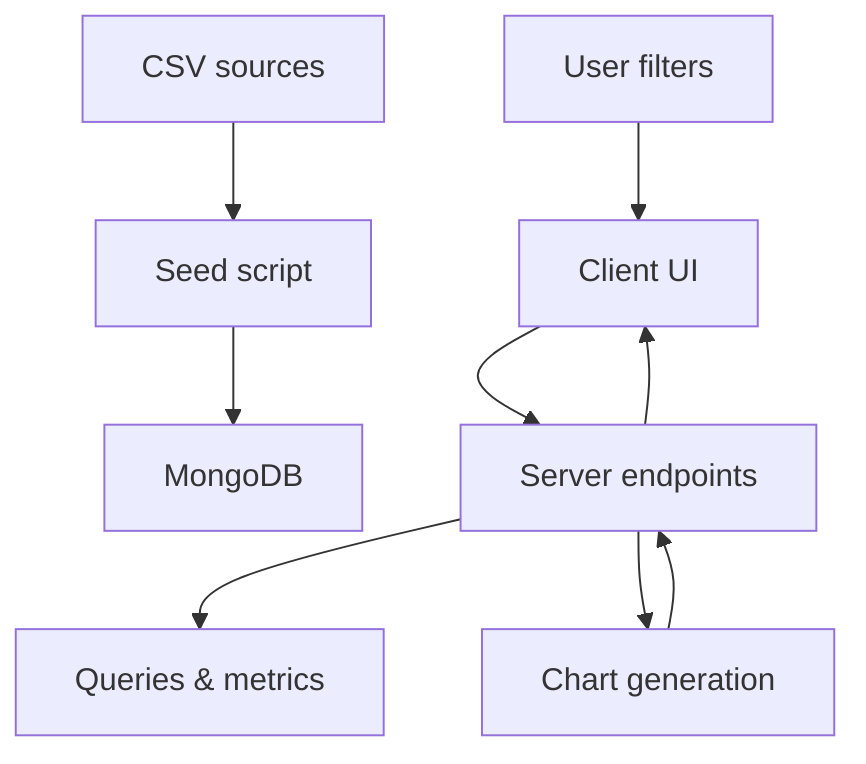

# Mantra4Change PBL Dashboard

A minimal monorepo for a synthetic PBL program review dashboard with grant reporting and chart analytics.

## Quick start

### Prerequisites

- Node.js 20+
- npm 10+
- Python 3.11+ / 3.12
- Docker (for MongoDB)

### Install

```bash
npm install
npm run install:analytics
```

### Run locally

```bash
cp apps/server/.env.example apps/server/.env
cp apps/client/.env.example apps/client/.env
cp apps/analytics/.env.example apps/analytics/.env

docker compose up -d
npm run seed
npm run dev
```

### Local URLs

- Client: `http://localhost:5173`
- Server: `http://localhost:5000`
- Analytics: `http://localhost:8000`
- MongoDB: `mongodb://localhost:27017/mantra4change`

## Commands

- `npm run dev` — start client, server, and analytics
- `npm run seed` — load CSV data into MongoDB
- `npm run verify` — run verification checks
- `npm test` — run server and Python tests
- `npm run build` — build client, server, and shared types
- `npm run lint` — lint workspaces

## Repo structure

- `apps/client` — React + Vite dashboard
- `apps/server` — Express API, MongoDB, report services
- `apps/analytics` — Python FastAPI chart generation
- `packages/shared-types` — shared TypeScript schemas

## Live deployment

The project can run locally with Docker Compose for the full backend stack.

```bash
docker compose -f docker-compose.prod.yml up --build
```

### Vercel frontend deployment

The client can also be deployed to Vercel as a static app. This repo includes `vercel.json` for the front-end build.

- Vercel builds `apps/client` with `@vercel/static-build`
- The app is served from `dist`
- SPA fallback is enabled via Vercel routes

#### Vercel environment variables

Set these values in the Vercel dashboard under Project Settings > Environment Variables:

- `VITE_API_BASE_URL` = `https://your-backend-host.com`

For local preview builds in Vercel, the value should point to the running API host.

> Note: the backend and analytics stack still need a separate host with MongoDB.

## System diagrams

### Architecture overview



### Data flow



## Notes

- Data is seeded from CSV files in `02_Primary_PBL_Data` and `03_Grant_Reporting_Evidence/csv`.
- AI narrative is optional and requires provider keys in `apps/server/.env`.
- CI is configured in `.github/workflows/ci.yml`.
