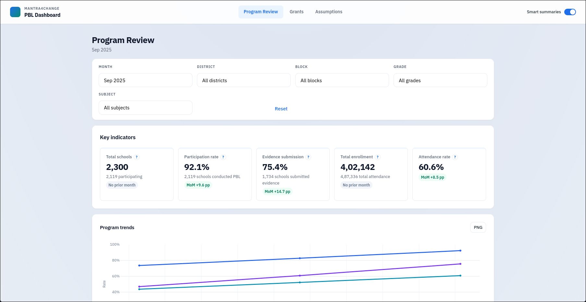
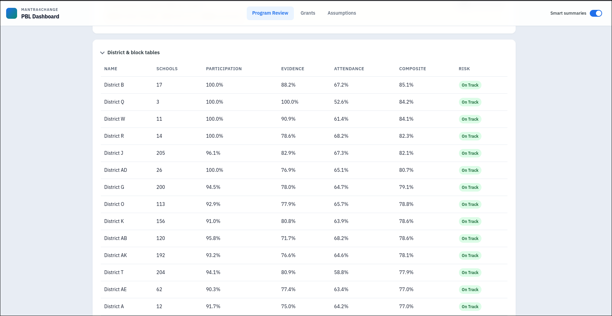
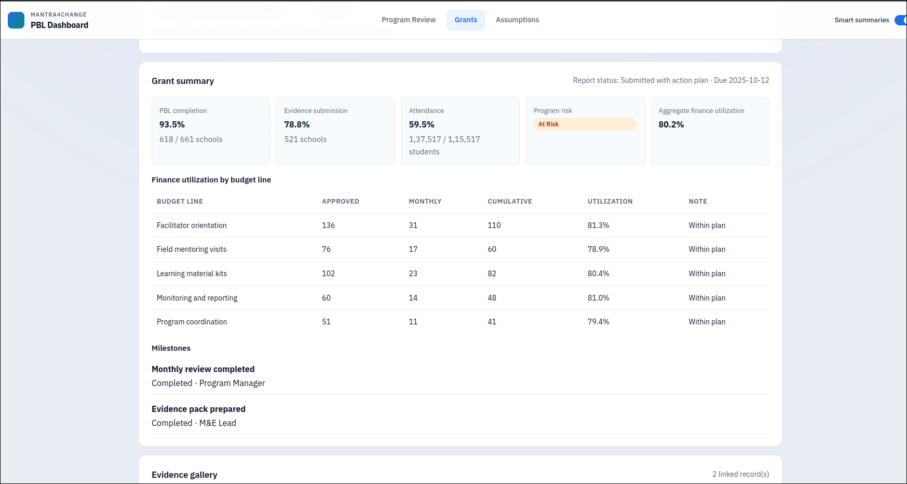
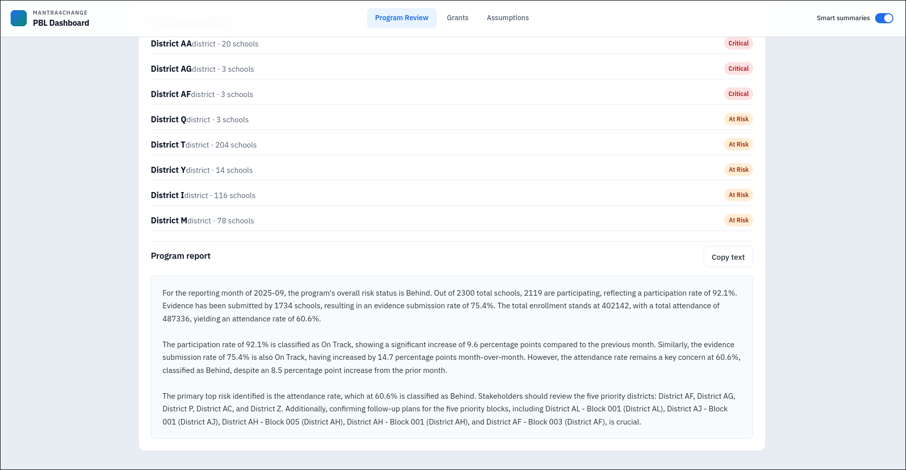
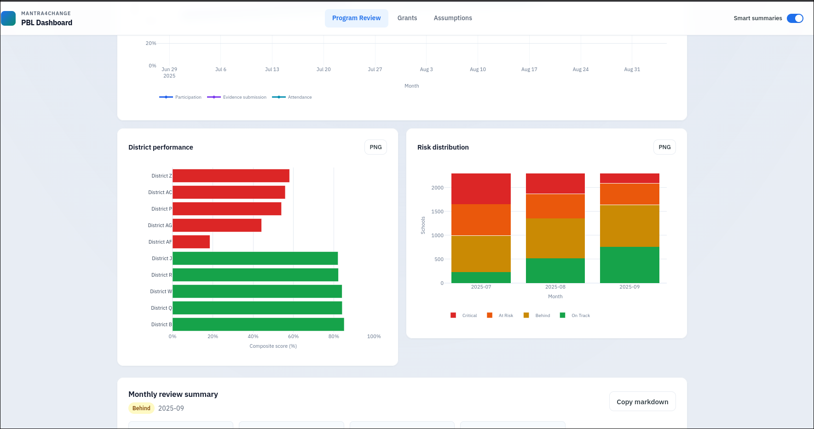
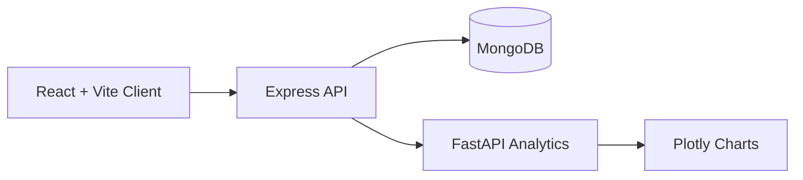
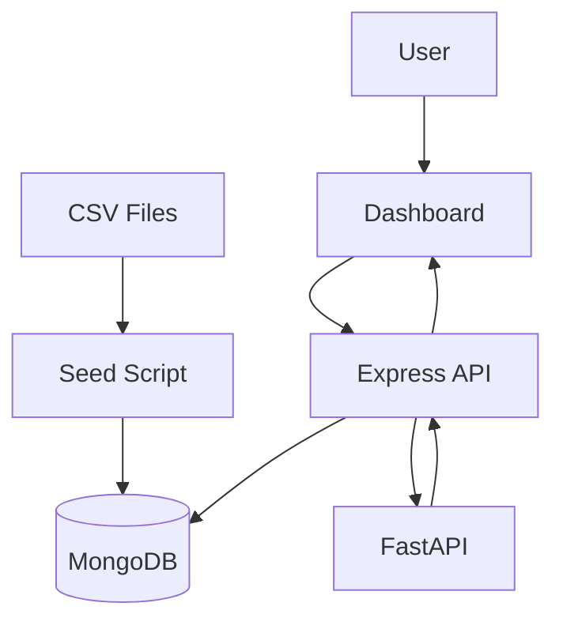

# Mantra4Change PBL Dashboard

A minimal full-stack dashboard for reviewing **Project-Based Learning (PBL)** programs with district-wise analytics, grant reporting, AI-generated summaries, and interactive visualizations.

---

## Dashboard Preview

<table>
<tr>
<td width="50%">

</td>
<td width="50%">

</td>
</tr>

<tr>
<td width="50%">

</td>
<td width="50%">

</td>
</tr>
</table>

<p align="center">

</p>

---

## Features

* District-wise PBL analytics
* Grant reporting dashboard
* AI-generated program review summaries
* Interactive charts and visualizations
* CSV-based data seeding
* REST API with MongoDB
* Python analytics service
* Shared TypeScript schemas across applications

---

## Tech Stack

| Layer            | Technology              |
| ---------------- | ----------------------- |
| Frontend         | React, Vite             |
| Backend          | Express.js              |
| Database         | MongoDB                 |
| Analytics        | FastAPI (Python)        |
| Charts           | Plotly                  |
| Shared Types     | TypeScript              |
| Containerization | Docker & Docker Compose |

---

## Repository Structure

```text
apps/
├── client/          # React + Vite dashboard
├── server/          # Express API
└── analytics/       # FastAPI analytics service

packages/
└── shared-types/    # Shared TypeScript schemas
```

---

## Prerequisites

* Node.js 20+
* npm 10+
* Python 3.11+
* Docker & Docker Compose

---

## Installation

```bash
npm install
npm run install:analytics
```

---

## Local Setup

Copy the environment files:

```bash
cp apps/server/.env.example apps/server/.env
cp apps/client/.env.example apps/client/.env
cp apps/analytics/.env.example apps/analytics/.env
```

Start MongoDB:

```bash
docker compose up -d
```

Seed the database:

```bash
npm run seed
```

Start all services:

```bash
npm run dev
```

---

## Local URLs

| Service   | URL                                     |
| --------- | --------------------------------------- |
| Frontend  | http://localhost:5173                   |
| Backend   | http://localhost:5000                   |
| Analytics | http://localhost:8000                   |
| MongoDB   | mongodb://localhost:27017/mantra4change |

---

## Available Commands

```bash
npm run dev        # Start all services
npm run seed       # Seed MongoDB from CSV files
npm run verify     # Verification checks
npm test           # Run backend and Python tests
npm run build      # Build all workspaces
npm run lint       # Lint the repository
```

---

## Architecture



---

## Data Flow



---

## Deployment

Run the complete backend stack locally using Docker Compose:

```bash
docker compose -f docker-compose.prod.yml up --build
```

### Frontend (Vercel)

The frontend can be deployed independently on Vercel.

Required environment variable:

```env
VITE_API_BASE_URL=https://your-backend-host.com
```

> The backend, analytics service, and MongoDB should be hosted separately.

---

## Notes

* Data is seeded from the provided CSV datasets.
* AI-generated narratives are optional and require provider API keys.
* Continuous Integration is configured via GitHub Actions.

---
