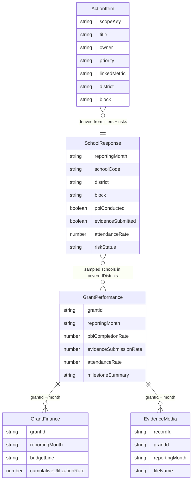
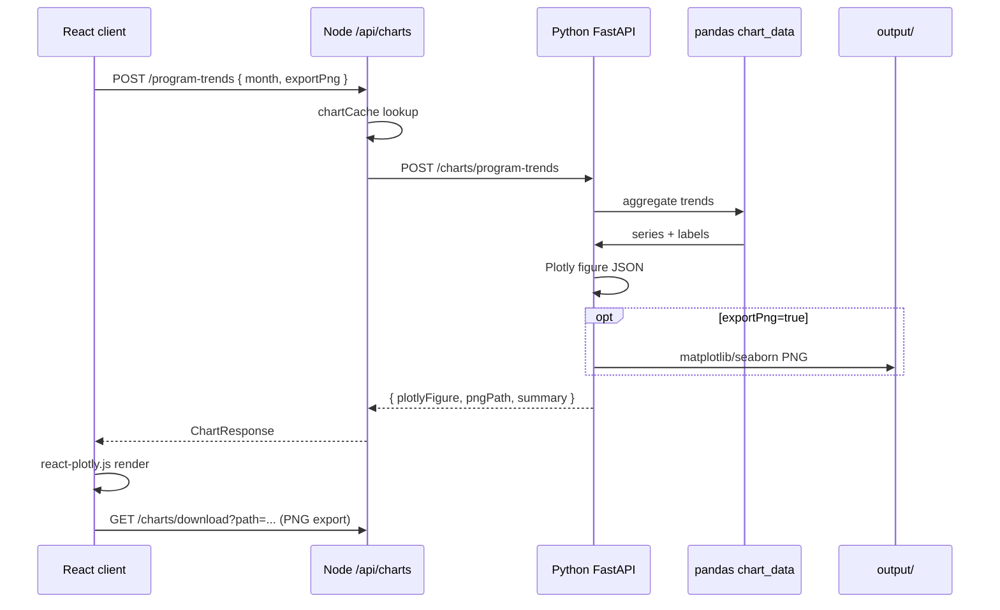

# Mantra4Change PBL Dashboard

Monorepo for monthly program review, grant reporting, and chart analytics over synthetic PBL and grant CSV data.

**Docs:** [API examples](./docs/api-examples.http) · [Postman collection](./docs/postman/Mantra4Change.postman_collection.json)

---

## 1. Problem statement

Mantra4Change runs project-based learning (PBL) programs across many schools and districts. Program managers need to:

- **Review monthly program health** — participation, evidence submission, attendance — filtered by geography, grade, and subject.
- **Identify risk and priority areas** — districts and blocks that need follow-up.
- **Prepare grant reporting** — finance, performance, milestones, and evidence in one place.

The stack is **React + Node/Express + MongoDB + Python/FastAPI** for aggregations and charts.

---

## 2. Architecture overview

```mermaid
flowchart TB
  subgraph Client["React + Vite (5173)"]
    UI[Program Review / Grants / Assumptions]
  end

  subgraph Server["Node Express API (5000)"]
    GW[API Gateway]
    PI[Program Intelligence]
    GR[Grant Reporting]
    CACHE[Chart cache 5m]
  end

  subgraph Analytics["Python FastAPI (8000)"]
    PD[pandas / numpy aggregations]
    PL[Plotly JSON figures]
    PNG[matplotlib / seaborn PNG]
  end

  subgraph Store[(MongoDB)]
    SR[SchoolResponse]
    GF[GrantFinance / GrantPerformance]
    EM[EvidenceMedia]
    ACT[ActionItem]
  end

  CSV[(CSV + images)] --> SR
  CSV --> GF
  CSV --> EM
  UI --> GW
  GW --> PI --> SR
  GW --> GR --> GF
  GW --> CACHE --> Analytics
  PD --> PL
  PD --> PNG
  Analytics -->|parity verify| PI
```

### Design rules

| Layer | Responsibility |
|-------|----------------|
| **Node server** | API gateway, Mongo orchestration, business rules, report text |
| **Python analytics** | pandas aggregations, chart data, Plotly/PNG generation |
| **MongoDB** | Normalized records from CSV seed |
| **React client** | Filters, KPIs, charts, review summary, grants, exports |

---

## 3. Setup

### Prerequisites

- Node.js 20+
- Python 3.11+ (3.12 recommended; see `apps/analytics/.python-version`)
- Docker (for MongoDB)
- npm 10+

### Steps

```bash
# 1. Install Node workspaces + Python venv
npm run install:all

# 2. Environment files
cp apps/server/.env.example apps/server/.env
cp apps/client/.env.example apps/client/.env
cp apps/analytics/.env.example apps/analytics/.env

# 3. MongoDB
docker compose up -d

# 4. Validate CSV quality (optional)
npm run validate:data

# 5. Seed MongoDB (idempotent clear + reload)
npm run seed

# 6. Evaluation verify (optional)
npm run verify

# 7. Development (all three services)
npm run dev
```

| Service | URL |
|---------|-----|
| Client | http://localhost:5173 |
| Server | http://localhost:5000 |
| Analytics | http://localhost:8000 |
| MongoDB | mongodb://localhost:27017/mantra4change |

### Environment variables

| Service | File | Key variables |
|---------|------|----------------|
| Server | `apps/server/.env` | `MONGODB_URI`, `ANALYTICS_SERVICE_URL`, `CLIENT_ORIGIN`, optional `GEMINI_API_KEY` / `AI_API_KEY` |
| Client | `apps/client/.env` | `VITE_API_BASE_URL` |
| Analytics | `apps/analytics/.env` | `ANALYTICS_PORT`, `PBL_CSV_DIR`, `GRANT_CSV_DIR`, `CHART_OUTPUT_DIR`, `NODE_SERVER_URL` |

#### Smart summaries (optional)

Written program and grant reports can use an OpenAI-compatible API (Gemini works via Google's compatibility endpoint). Add to `apps/server/.env`:

```env
ENABLE_AI_NARRATIVE=true
GEMINI_API_KEY=your_key
AI_MODEL=gemini-2.5-flash
AI_BASE_URL=https://generativelanguage.googleapis.com/v1beta/openai
```

Turn **Smart summaries** on in the dashboard header. Reports are checked against computed metrics before display; if the model adds numbers that aren't in the data, a template summary is used instead.

Without an API key, reports still work using built-in templates.

### npm scripts

| Script | Description |
|--------|-------------|
| `npm run dev` | Server + client + analytics concurrently |
| `npm run seed` | Clear + reload all collections from CSV |
| `npm run verify` | Mongo, parity, grant pipeline, route smoke tests |
| `npm test` | Server unit + Python tests |
| `npm run test:integration` | Seed ? dashboard ? grant report (Mongo required) |
| `npm run build` | shared-types, server, client |
| `npm run lint` | ESLint all workspaces |

---

## 4. Data model

### Entity relationship (logical)



### MongoDB collections

| Collection | Documents (seed) | Unique key |
|------------|------------------:|------------|
| `schoolresponses` | 6,900 | `reportingMonth` + `schoolCode` |
| `grantfinances` | 45 | `grantId` + `reportingMonth` + `budgetLine` |
| `grantperformances` | 9 | `grantId` + `reportingMonth` |
| `evidencemedia` | 9 | `recordId` |
| `actionitems` | generated per filter scope | `scopeKey` + `title` |

Models: `apps/server/src/models/`. Seed: `apps/server/src/scripts/seed.ts`.

---

## 5. Metric formulas

All rates returned by the API are **decimals in [0, 1]** unless noted. Filters: `month`, `district`, `block`, `grade`, `subject`.

### Participation

```
participatingSchools = count(schools where pblConducted = true)
totalSchools         = count(schools in filter scope)
participationRate    = participatingSchools / totalSchools   (0 if totalSchools = 0)
```

Implementation: `aggregateParticipation()` � `apps/server/src/programIntelligence/metrics.ts`

### Evidence submission

```
evidenceSchools           = count(schools where evidenceSubmitted = true)
evidenceSubmissionRate    = evidenceSchools / totalSchools
```

### Attendance

Per school, scoped enrollment/attendance depend on grade/subject filters (class-level columns for grades 6�8). Aggregated:

```
attendanceRate = ?(schoolRate � schoolEnrollment) / ?(schoolEnrollment)
```

Unfiltered: uses `totalEnrollment`, `totalAttendance`, `attendanceRate` from each school record.

### Month-over-month (MoM)

For reporting months `2025-08` and `2025-09` (and `2025-07` ? `2025-08`):

```
MoM.participationRate = currentMonth.participationRate - previousMonth.participationRate
```

Same for evidence and attendance. **Interpretation:** a delta of `0.05` means **+5 percentage points**, not +5% relative change. `2025-07` has no prior month ? MoM fields omitted.

Implementation: `buildDashboardMetrics()` � `apps/server/src/programIntelligence/riskEngine.ts`

### Composite (geography)

```
compositeScore = (participationRate + evidenceSubmissionRate + attendanceRate) / 3
```

Geography risk status is `classifyRiskFromRate(compositeScore)`.

---

## 6. Risk thresholds

Defined in `packages/shared-types` (`RISK_THRESHOLDS`):

| Status | Condition (rate � 100) |
|--------|-------------------------|
| **On Track** | ? 75% |
| **Behind** | 60% � 74.9% |
| **At Risk** | 35% � 59.9% |
| **Critical** | < 35% |

### Examples

| Metric | Rate (decimal) | Status | Explanation snippet |
|--------|----------------|--------|---------------------|
| Participation | 0.82 | On Track | "82.0%, classified as On Track (>= 75%)" |
| Evidence | 0.68 | Behind | "68.0%, classified as Behind (60% to below 75%)" |
| Attendance | 0.52 | At Risk | "52.0%, classified as At Risk (35% to below 60%)" |
| Composite | 0.28 | Critical | "28.0%, classified as Critical (below 35%)" |

Helper: `explainRisk(label, rateDecimal)` � used in KPI tooltips and risk panel.

Overall program risk = **worst** status among participation, evidence, attendance, and composite indicators.

---

## 7. Chart pipeline



| Chart | Node proxy | Python handler |
|-------|------------|----------------|
| Program trends | `POST /api/charts/program-trends` | `generate_program_trends()` |
| District performance | `POST /api/charts/district-performance` | `generate_district_performance()` |
| Risk distribution | `POST /api/charts/risk-distribution` | `generate_risk_distribution()` |
| Grant utilization | `POST /api/charts/grant-utilization` | `generate_grant_utilization()` |

- **Plotly** � interactive figures in the UI (`react-plotly.js`).
- **matplotlib / seaborn** � static PNG when `exportPng: true`; served via analytics `/static/charts/` and Node proxy download.
- **Cache** � 5-minute in-memory cache keyed by chart type + filter hash (`apps/server/src/services/chartCache.ts`).

Sample payloads: `npm run charts:samples` ? `apps/analytics/app/samples/chart-responses/`

---

## 9. Assumptions & limitations

### Assumptions

- **Synthetic data only** � not real schools, donors, or field photos.
- **One row per school per month** � duplicates rejected at seed.
- **Rates as decimals 0�1** in CSV and MongoDB.
- **Reporting months fixed** � `2025-07`, `2025-08`, `2025-09`; default dashboard month `2025-09`.
- **Idempotent seed** — every `npm run seed` clears and reloads.

### Limitations

- No authentication or multi-tenancy.
- Batch CSV ingestion only (no live survey webhook).
- Chart cache is process-local (lost on restart).
- Large Plotly bundle (~5MB) — no code-splitting yet.
- Action items are suggested follow-ups, not a full workflow engine.
- PDF export not implemented (markdown + PNG provided).

---

## 10. Production readiness

Current state: solid for local demo and development, not production-hardened.

| Area | Today | Production recommendation |
|------|-------|---------------------------|
| **Auth** | None | JWT/OAuth2 + RBAC |
| **Caching** | 5m in-memory chart cache | Redis for charts + filter option cache |
| **Observability** | Console logs, health endpoints | Structured JSON logs, OpenTelemetry traces |
| **Scaling** | Single Node + single Python worker | Horizontal API replicas; dedicated analytics workers |
| **Secrets** | `.env` files | Vault / AWS Secrets Manager |
| **CI/CD** | GitHub Actions lint/test/build/verify | Staged deploy, smoke tests post-deploy |
| **Data** | Manual seed | Scheduled ETL, schema migration tool |

Health: `GET /api/health`, `GET /api/health/full` (Mongo + analytics status).

---

## 11. Future improvements

- PDF grant report packs (puppeteer/weasyprint from markdown + embedded PNGs).
- Role-based views and row-level security on district data.
- Real-time ingestion pipeline (survey webhook ? Mongo ? incremental aggregates).
- Redis-backed chart and dashboard cache with cache invalidation on seed.
- Action item notifications (email/Slack) and owner assignment UI.
- Semantic search over evidence captions tied to record IDs.
- Dashboard code-splitting and lazy-loaded Plotly.
- Multi-year reporting month support and fiscal period config.

---

## API reference

Full HTTP examples: [`docs/api-examples.http`](./docs/api-examples.http)  
Postman: import [`docs/postman/Mantra4Change.postman_collection.json`](./docs/postman/Mantra4Change.postman_collection.json)

### Program intelligence

| Endpoint | Description |
|----------|-------------|
| `GET /api/program/filters` | Filter options |
| `GET /api/program/dashboard` | KPIs + MoM |
| `GET /api/program/districts` | District table |
| `GET /api/program/blocks` | Block table |
| `GET /api/program/risks` | Risk indicators + geographies |
| `GET /api/program/review-summary` | Achievements, gaps, priorities |
| `GET /api/program/monthly-review` | Monthly review summary |
| `GET /api/program/action-items` | Recommended actions |
| `POST /api/program/action-items/regenerate` | Refresh actions |
| `PATCH /api/program/action-items/:id` | Update status/owner |

### Grants, charts, reports, meta

| Endpoint | Description |
|----------|-------------|
| `GET /api/grants` | Grant catalog |
| `GET /api/grants/:grantId/:month/facts` | Assembled facts |
| `GET /api/grants/:grantId/:month/report` | Grant report text |
| `POST /api/charts/*` | Chart proxy (4 types) |
| `POST /api/reports/program` | Program report text |
| `POST /api/reports/grant` | Grant report text |
| `GET /api/meta/seed-preview` | Expected CSV document counts |

### Python analytics (direct)

| Endpoint | Description |
|----------|-------------|
| `GET /analytics/program/dashboard` | Pandas dashboard parity |
| `POST /analytics/verify-dashboard` | Node vs pandas diff |
| `POST /charts/*` | Chart generation source |
| `GET /analytics/data-quality` | Data quality JSON |

---

## Testing & CI

```bash
npm test                 # 27 server + 9 Python
npm run test:integration # requires seeded MongoDB
npm run verify           # evaluation harness
```

GitHub Actions: `.github/workflows/ci.yml` � install, lint, typecheck, build, seed, tests, verify.

### Seed verification

| Collection | Expected count |
|------------|---------------:|
| SchoolResponse | 6,900 |
| GrantFinance | 45 |
| GrantPerformance | 9 |
| EvidenceMedia | 9 |

---

## Repository layout

```
mantra4Changee/
├── apps/server/       Express + Mongoose + program intelligence
├── apps/client/       React + Vite dashboard
├── apps/analytics/    FastAPI + pandas + charts
├── packages/shared-types/
├── data/              Symlinks to CSV folders
├── docs/              API examples + Postman
└── docker-compose.yml
```

## License

Internal use — Mantra4Change.
